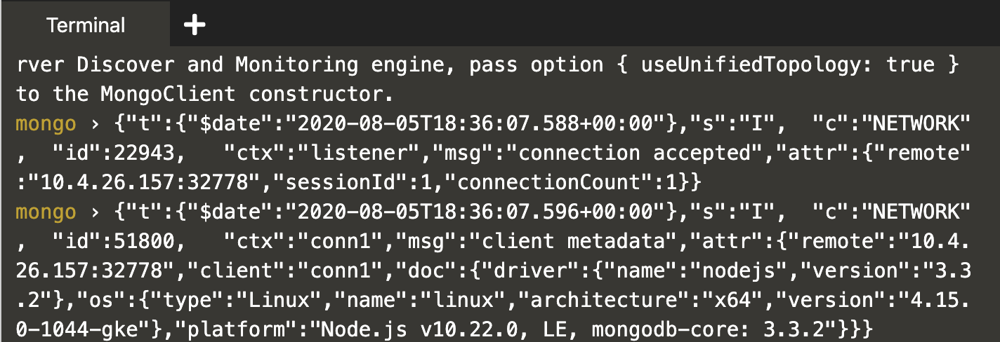
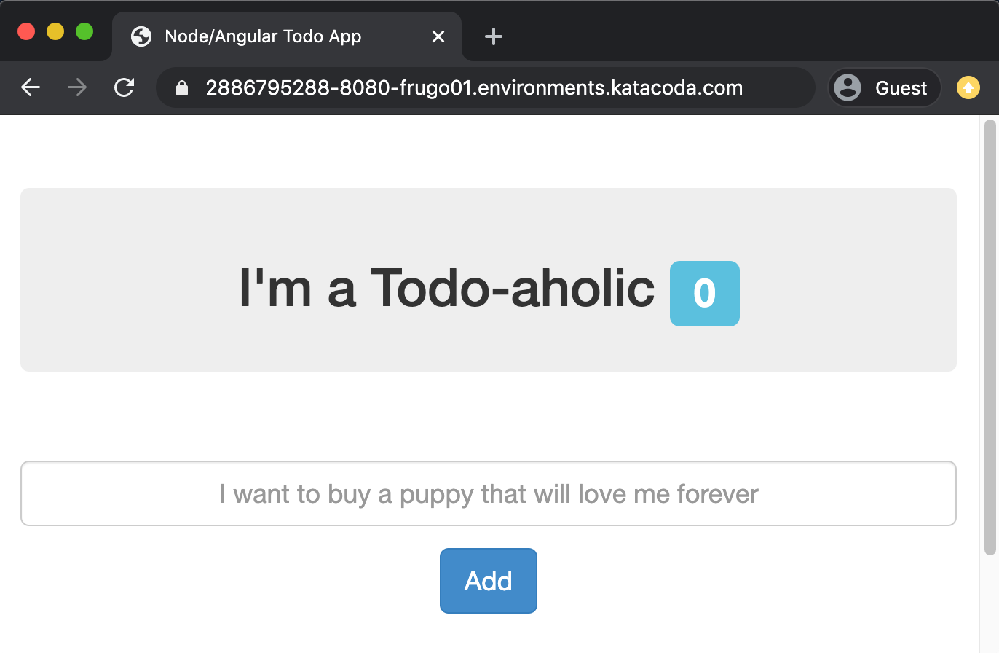

1. **Run `blimp up`{{execute}}** to boot your development environment. This command:

   * **Boots** up all the containers.
   * **Syncs** the local code into the Node.js container.
   * Sets up **tunnels** so that you can access the containers as if they were running locally.

1. **Wait for the containers to boot, and for them to start printing logs**

   

1. **Access the application**

   Open https://[[HOST_SUBDOMAIN]]-8080-[[KATACODA_HOST]].environments.katacoda.com/
   in your browser.

   This link routes to `localhost:8080` of your current demo session.

   

   _Note_: If you were running locally, you would access your application at
   `localhost:8080`. But we have to use the Katacoda link since we're running
   within your browser.

1. **Add a couple todos**

   Add some todos via the above link. In the next step, we'll make a code
   change that changes the output of the todos.
