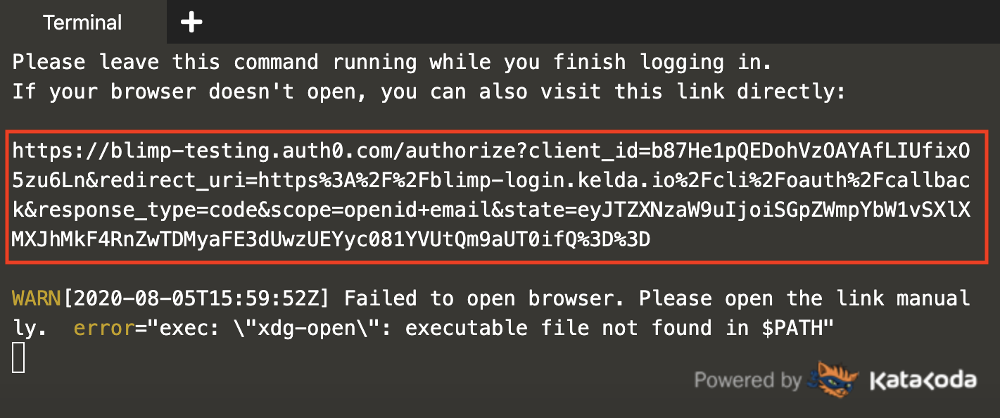

No problem if you don't have a Blimp account yet. You can create it as part of step 2.

_The initialization script takes about 15 seconds to finish._ Once you can type into the terminal:

1. **Run `blimp login`{{execute}}.** This will connect your session with your Blimp
   account.
1. **Open the link printed by `blimp login` in your browser**

   

1. **Login (or create a new account) on the login page**

   Once you've logged in, the CLI will automatically fetch your credentials.

   You're now ready to boot the example app in your personal environment!
